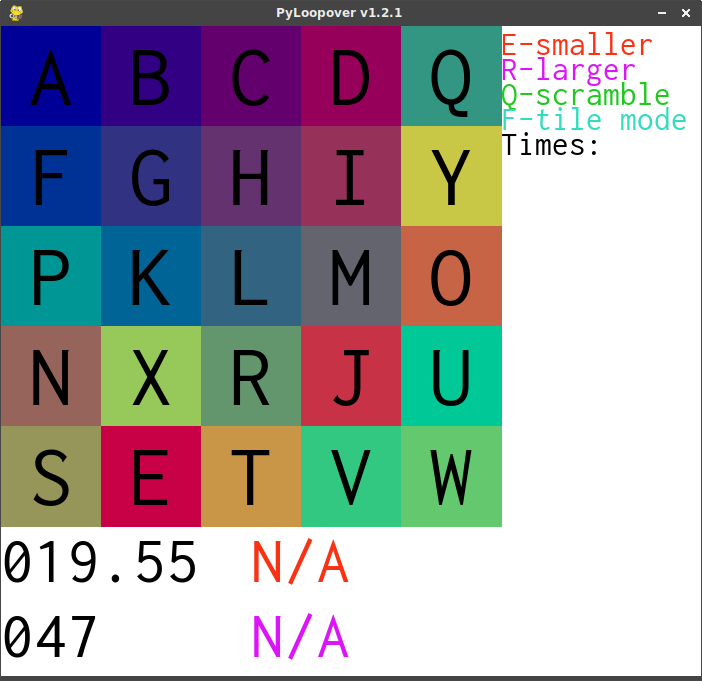
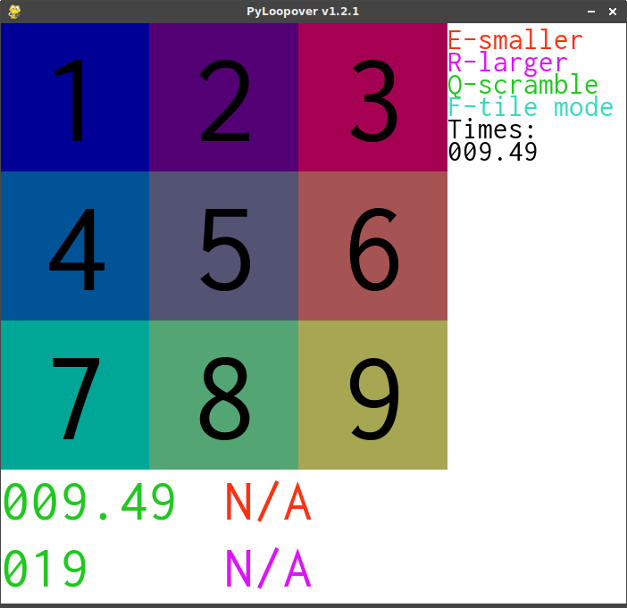
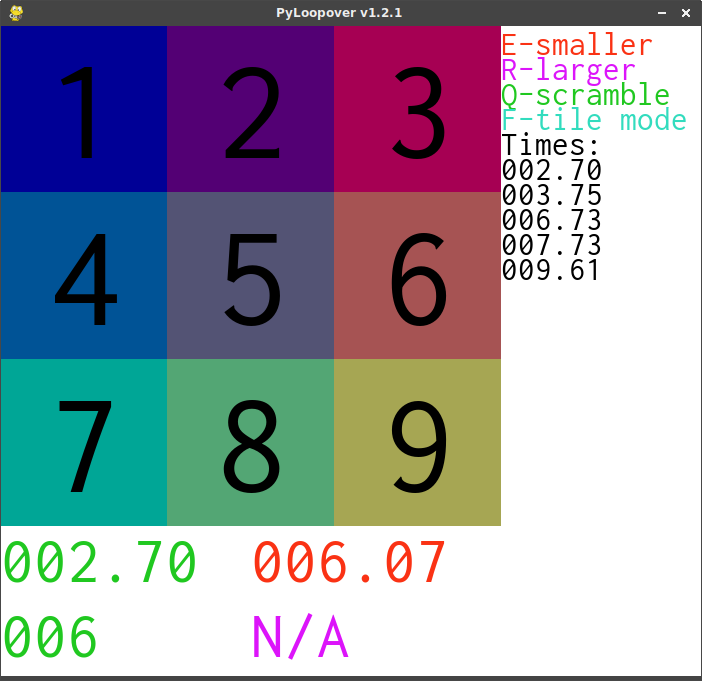

# PyLoopover
PyLoopover is an implimentation of carykh's loopover game.
 

## Features
- Timer
- Move counter
- Average of 5 and 10 (time)
- Letter and number labels
- Time history
- Colorfull!
## Controlls
#### Movement
- Move your mouse over a square, and then use W to move it up, A to move it left, S to move it down, or D to move it right
- Just click and drag with the mouse
#### Changing the size of the game
The game starts at 5x5
- To make it larger, use R
- To make it smaller, use E

A smaller board size:
 

#### Misc.
- To scramble, press Q
- To toggle between letter and number tile labels, press F
## Interface
#### Board
This is the main playing area
#### Stats
There is a stats area underneath the main board area.
It contains the following items
- **Timer** -- This shows the time since the first move.  When the board has been solved, it will turn green.
It is in the upper left corner
- **Move Count** -- This shows how many moves you have made.  When the board has been solved, it will turn green.
It is in the lower left corner
- **Average of 5** -- This shows your average time over the last 5 games.  It is orange.
Before you have played 5 games, it says N/A.

The average of 5 feature:
 

- **Average of 10** -- This shows your average time over the last 10 games. It is purple.
Before you have played 10 games, it says N/A.
#### History and Help Area
This is an area to the right of the board.
It shows all of the keys, and what they do, as well as showing all of your recent times.
These times are shown with the most recent at the top.
## Running
### Linux
1. Make sure you have python **3** installed
2. Make sure main.py is executable, then use `./main.py` to run it
### Windows
1. Install python 3 [here](https://www.python.org/downloads/release/python-372/)
2. Open the PyLoopover folder, and double click main.py to start.
## High DPI
**How to make High DPI screens display PyLoopover Properly**
1. Open `config.py` in a text editor
2. Find the lines that say `width=`, `height=`, `stats_height=`, and `stats_width`
3. Double the numbers after the equal sign (`=`)
4. Run main.py. The window should be the right size. (If it is still too small, double the numbers again)
